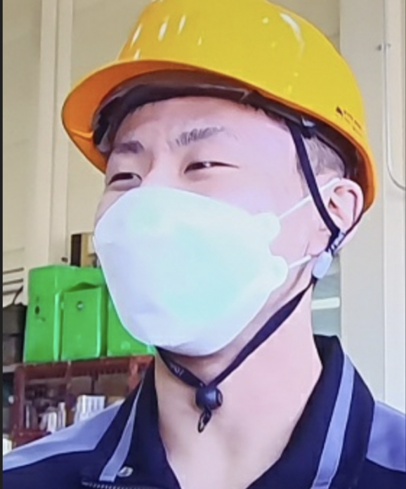
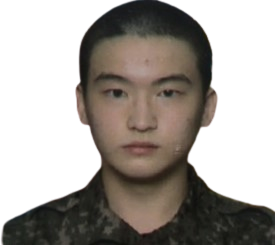

<div align="center">
  <h1 style="text-align: center;">⚽️⚽️히딩크 및 평봉필드 예약 시스템⚽️⚽️</h1>
  
  </div>

<div align="center">
한동대학생들이 히딩크 풋살장과 평봉필드를 편하게 이용할 수 있도록 예약하는 C 언어 기반 프로그램입니다.
</div>
</p>

### ⚽️⚽️개발환경 및 언어⚽️⚽️
<div align="center">
 
 
 
                                                                                                            

</div>
--------------------------


## ⚽️⚽️히딩크 및 평봉필드 예약 시스템 소개⚽️⚽️
- 한동대 풋살과 축구장 대여를 기반으로 하는 프로그램입니다. 
- 한동대학교 학생들만 히딩크 혹은 평봉필드를 예약하는 것이 가능합니다.
- 기초적인 축구 인원모집, 팀 배틀등 다양한 시스템을 사용할 수 있습니다. 
- 자동으로 부족한 팀과 매칭을 할 수 있고 무작위팀과 만날 수 있게 설계되었습니다. 


--------------------------


## ⚽️⚽️기능 설명⚽️⚽️

```c
typedef struct{
    char name [100];  //대표자 이름
    int playground; //0일 경우 평봉, 1일 경우 히딩크
    char teamname[100];  //팀이름
    int countnumber;  //팀 전체 인원
    int studentnumber;
} Person;

typedef struct {//경기장을 예약하는 사용하는 구조체이다.
    int starttime;//시작 시간을 받는다.
    int endtime;//끝나는 시간을 받는다.
    char teamname [100];//팀의 이름을 받는다.
    char name[100];//빌리는 대표자의 이름을 받는다.
    int student;//수정하거나 지울때 자신의 정보를 확인하기 위해서 필요.
} Team;

typedef struct {
    char phonenumber[12]; //상대팀 대표의 전화번호
    int start;//축구를 할 수 있는 시간 
    int end;
    int student;//수정하거나 지울때 자신의 정보를 확인하기 위해서 필요.
    char teamname [100];//팀 이름
    char detail [100];//자신의 팀을 어필 or 상대방의 조건 or 끝까지 간다.
} Search;//팀이 부족해서 다른 상대팀을 찾는데 필요한 구조체


int selectMenu();//1,2,3,4는 메뉴를 출력하는 함수이다.
int selectMenu2();
int selectMenu3();
int selectMenu4();
int idcheck();//학번

int loadData(Person * *s,int selectnumber); //저장된 파일을 가지고 오는 함수입니다. 
void saveData(Person **s, int count,int selectnumber); //파일을 저장하는 함수입니다. 
int createProduct(Person *s, int studentnumber);  //새로운 product를 만드는 함수입니다. 
void readproduct(Person *s);    //파일을 한줄 출력하는 함수입니다. 
void listproduct(Person *s[], int count);  //파일을 List로 출력하는 함수입니다. 
int updateProduct(Person *s, int studentnumber); //입력된 값을 수정하는 함수입니다. 
int selectdatano (Person *s[], int count);  //정말 맞는지 확인하는 함수입니다. 
int detectTeam(Team *a[],char y[]);  //삭제하는 함수입니다. 
int deleteproduct(Person *s, int studentnumber);  //삭제하는 함수입니다. 
void searchName(Person **s, int count);  //이름을 통해서 경기장을 검색하는 함수입니다. 

int logout();//학번을 다시 입력 받도록하는 함수이다. =>학번을 다시 입력 받아서 로그아웃 상태로 만드는 것.
int reserveTime(Team *t[]);//경기장을 예약하는데 시작 시간과 끝나는 시간을 받는 함수이다.
void reserveteamName(Team *t[],int time);//경기장 예약에서 팀의 이름과 대표자의 이름을 받는 함수이다.
void reserveSystem(Team **t,int id);//경기장 예약 함수이다. =>reserveTime과 reserveteamName을 호출한다.
void teamfillmethod(Team **t);//구조체를 24개 메모리 할당 받고, 초기화 하는 함수이다.
void printeachTeam(Team *t);//팀의 내용을 출력하는 함수이다.
void printTeam(Team **t);//경기장 예약을 보여주는 함수이다. =>printeachTeam을 호출한다.
void deleteTeam(Team **t,char a[],int id);//예약한 팀을 삭제하는 함수이다.
void updateTeam(Team **q,int studentnumber);
void saveTeamReserve(Team **t,int selectnumber);//경기장 예약 내용을 파일에 저장하는 함수이다.
void loadTeamReserve(Team **s, int selectnumber);//경기장 예약 내용의 파일을 읽어오는 함수이다.
int selectdatano2 (Team *a[], int count);//각 함수마다 출력되는 함수를 표현합니다. 

int selectdatano3 (Search *q[], int count); //각 함수마다 출력되는 함수를 표현합니다. 
int checkid(int studentnumber,int checknumber);//예약,취소,변경을 할 때 학번이 같은지 확인하는 함수이다.
void inputPhonenumber(Search **q,int index);//상대방 팀 찾기 옵션에서 자신의 팀을 예약할 때 대표자의 전화번호를 입력받는 함수이다.
void inputInformation(Search **q,int index);//상대방 팀 찾기 옵션에서 자신의 팀을 예약할 때 팀의 이름, 세부사항을 입력받는 함수이다.
int inputSearchInformation(Search **q,int index,int studentnumber);//상대방 팀 찾기 옵션에서 자신의 팀을 예약하는 함수이다.
void updateInformation(Search **q,int index,int studentnumber);//업데이트 하는 함수이다.
void deleteInformation(Search **q,int studentnumber,int dex);//삭제 함수이다.
void printea(Search *q);//명단 한 개를 출력하는 함수이다.
void pritnInformation(Search **q,int index);//명단을 출력하는 함수이다.
int loadSearchTeam(Search **s, int selectnumber);//상대방 팀 찾기 구조체를 파일에서 불러오는 함수이다.
void saveSearchTeam(Search **q,int selectnumber,int index);//상대방 팀 찾기 구조체를 파일에 저장하는 함수이다.
void automatchingSystem(Search **q,Team ** t,int index,int selectnumber);//같은 시간대에 상대팀을 알려주고 자동적으로 경기장을 예약하는 시스템입니다.
void deleteInformation2(Search **q,int index);//데이터를 지우는 함수입니다.

```

<h2>팀소개 및 팀원이 맡은 역할</h2>

<div align="center">
 |

</div>

## ⚽️김영규 [yongkyu Kim GITHUB LINK](https://github.com/kimbbanggyu)
- 공동 개발자
- 자동화 시스템구현
- 
- CRUD 구현
- 코드 관리

## ⚽️김태민 [Taemin Kim GITHUB LINK](https://github.com/taeminkim-408)
- 공동 개발자
- 메뉴시스템 구현
- login&logout 구현
- 코드 관리
- Repo Owner
- Rename.md, Wiki관리
  


